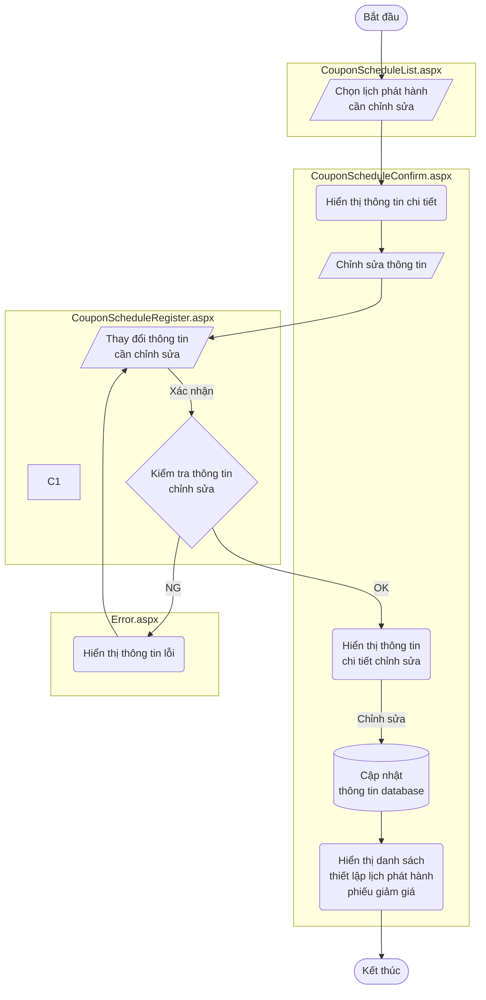
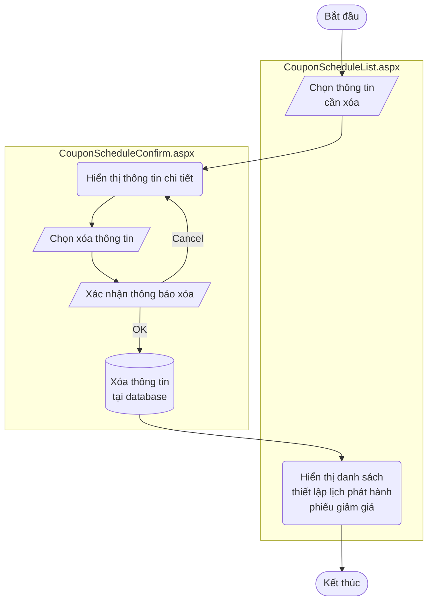

```mermaid
flowchart TB

  subgraph CouponScheduleList.aspx
    A
  end

  subgraph CouponScheduleConfirm.aspx
    A1
    B
    G
    H
    I
  end

  subgraph CouponScheduleRegister.aspx
    C
    C1
    D
  end

  subgraph Error.aspx
    F
  end

  Start([Bắt đầu]) --> A[/Chọn lịch phát hành\n cần chỉnh sửa/]
  A --> A1("Hiển thị thông tin chi tiết")
  A1 --> B[/Chỉnh sửa thông tin/]
  B --> C[/"Thay đổi thông tin
      cần chỉnh sửa"/]
  C --> |Xác nhận| D{Kiểm tra thông tin\n chỉnh sửa}
  D --> |OK| G("Hiển thị thông tin
      chi tiết chỉnh sửa")
  D --> |NG| F(Hiển thị thông tin lỗi)
  F --> C
  G --> |Chỉnh sửa| H[("Cập nhật\n thông tin database")]
  H --> I(Hiển thị danh sách\n thiết lập lịch phát hành\n phiếu giảm giá)
  I --> End([Kết thúc])
  
```

### Sơ đồ luồng xóa lịch phát hành

```mermaid
flowchart TB

  subgraph CouponScheduleList.aspx
    A
    D
  end

  subgraph CouponScheduleConfirm.aspx
    A1
    B
    B1
    C
  end

  Start([Bắt đầu]) --> A[/Chọn thông tin\n cần xóa/]
  A --> A1("Hiển thị thông tin chi tiết")
  A1 --> B[/Chọn xóa thông tin/]
  B --> B1[/"Xác nhận thông báo xóa"/]
  B1 -->|OK| C[(Xóa thông tin
      tại database)]
  B1 -->|Cancel| A1
  C --> D(Hiển thị danh sách\n thiết lập lịch phát hành\n phiếu giảm giá)
  D --> End([Kết thúc])
  
```
