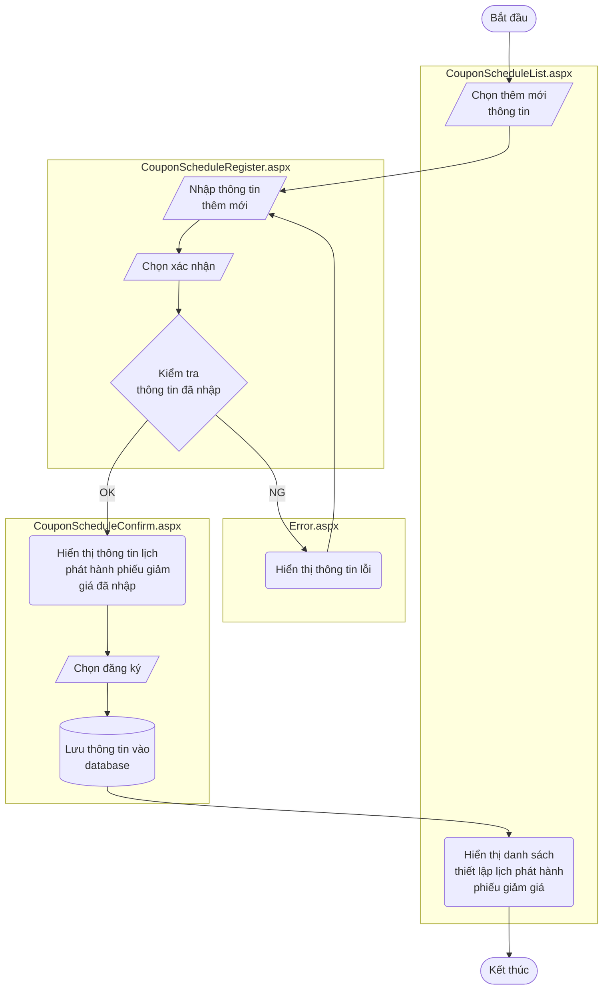

```mermaid
flowchart TB

  subgraph CouponScheduleList.aspx
    A
    H
  end

  subgraph CouponScheduleRegister.aspx
    B
    B1
    C
  end

  subgraph Error.aspx
    D
  end

  subgraph CouponScheduleConfirm.aspx
    E
    F
    G
  end

  Start([Bắt đầu]) --> A[/Chọn thêm mới\n thông tin/]
    A --> B[/Nhập thông tin\n thêm mới/]
    B --> B1[/"Chọn xác nhận"/]
    B1 --> C{"Kiểm tra
        thông tin đã nhập"}
    C --> |OK| E("Hiển thị thông tin lịch
        phát hành phiếu giảm giá đã nhập")
    C --> |NG| D(Hiển thị thông tin lỗi)
    D --> B
    E --> F[/"Chọn đăng ký"/]
    F --> G[("Lưu thông tin vào
        database")]
    G --> H("Hiển thị danh sách
        thiết lập lịch phát hành
        phiếu giảm giá")
    H --> End([Kết thúc])
  
```
